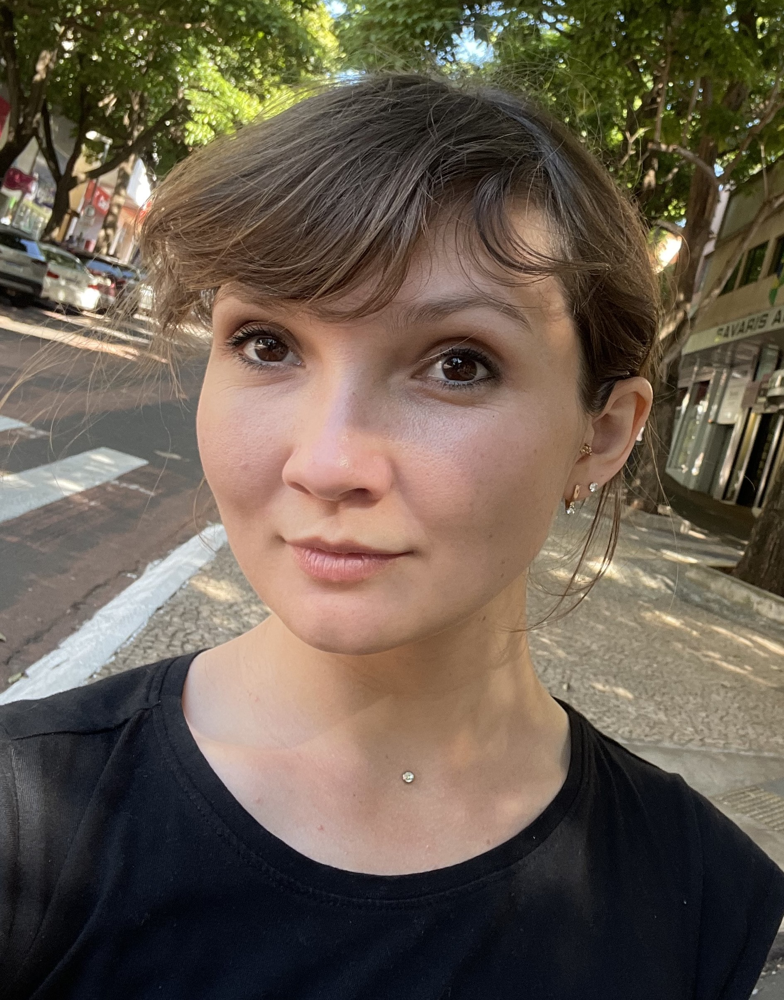

# Olesya Klimova

#### 10.11.2023

### discord: alurity.
### phone: +79173294176
### email: alurity@mail.com

### My goals and priorities:

The UI development came from Backend development, the study of frontend technologies was independent, the main focus was only on the tools that are needed "here and now". The main goal of the course for me is to improve the quality of knowledge and eliminate gaps in understanding JS.

### My skills:

- JavaScript
- TypeScript
- C#
- SQL
- React
- Angular 2+
- NextJs
- .Net Framework
- MySQL
- GitHub
- GitLab
- Bitbucket
- Atlassian Jira
- Selenium and Cucumber

### Work Experience:

Fron-end developer

### Education

Self-education

### English-level

Intermediate
Work with customers from USA